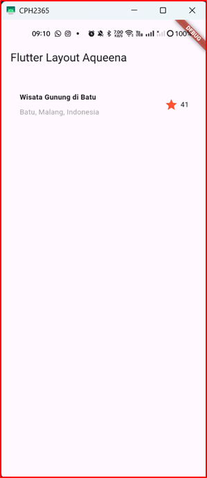
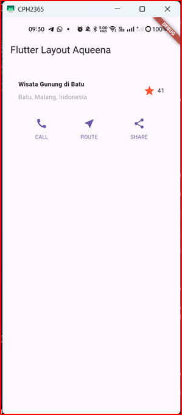
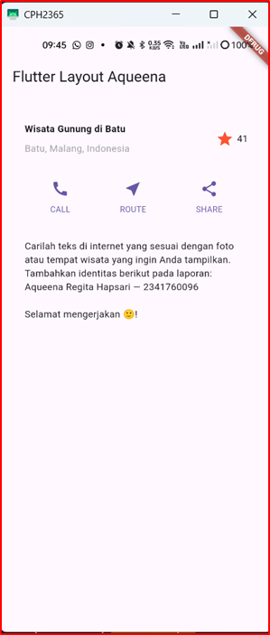
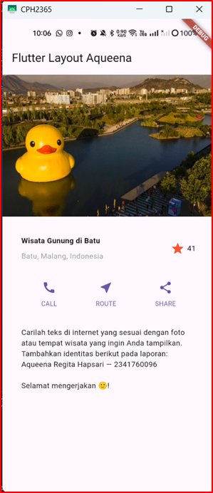

# Flutter Layout Aqueena

> Implementasi Jobsheet 6 — Layout & Navigasi (Praktikum 1–4)

## Identitas Mahasiswa

* **Mata Kuliah:** Pemrograman Mobile
* **Dosen Pengampu:** Ade Ismail, S.Kom., M.TI
* **Nama:** Aqueena Regita Hapsari
* **NIM:** 2341760096
* **Kelas:** SIB 3C
* **No Absen:** 06

---

## 📌 Ringkasan Hasil

* Praktikum 1: **Title Row** (Expanded, alignment, padding, icon + counter)
* Praktikum 2: **Button Row** (3 kolom: CALL, ROUTE, SHARE)
* Praktikum 3: **Text Section** (teks dengan padding & softWrap)
* Praktikum 4: **Image + ListView** (gambar asset + konten di-scroll)

---

## 📁 Struktur Project (ringkas)

```
lib/
  main.dart
images/
  lake.jpg
pubspec.yaml
```

Tambahkan asset di `pubspec.yaml`:

```yaml
flutter:
  assets:
    - images/lake.jpg
```

---

## 🚀 Cara Menjalankan

```bash
flutter pub get
flutter run
```

> **Tip:** Jika hot reload tidak bereaksi, lakukan **hot restart** atau `flutter clean && flutter pub get`.

---

## 🧪 Praktikum 1 — Membangun Layout (Title Row)

<details>
<summary><b>📷 Screenshot Hasil Akhir (klik untuk membuka)</b></summary>

Letakkan file screenshot di folder `docs/` lalu tampilkan:

```

```


</details>

**Penjelasan Singkat**

* `Column` dibungkus **`Expanded`** agar konten teks mengambil sisa ruang di dalam `Row`.
* `crossAxisAlignment: CrossAxisAlignment.start` untuk merapat ke kiri.
* Baris judul pertama diberi **padding bottom 8** via `Container`/`Padding`.
* Tambahkan **ikon bintang merah** dan teks **“41”** di sisi kanan.

**Cuplikan Kode Utama**

```dart
final titleSection = Container(
  padding: const EdgeInsets.all(32),
  child: Row(
    children: [
      Expanded(
        child: Column(
          crossAxisAlignment: CrossAxisAlignment.start,
          children: const [
            Padding(
              padding: EdgeInsets.only(bottom: 8),
              child: Text('Wisata Gunung di Batu',
                style: TextStyle(fontWeight: FontWeight.bold)),
            ),
            Text('Batu, Malang, Indonesia',
              style: TextStyle(color: Colors.grey)),
          ],
        ),
      ),
      Icon(Icons.star, color: Colors.red),
      SizedBox(width: 4),
      Text('41'),
    ],
  ),
);
```

---

## 🧭 Praktikum 2 — Button Row (CALL/ROUTE/SHARE)

<details>
<summary><b>📷 Screenshot Hasil Akhir</b></summary>

```

```

</details>

**Penjelasan Singkat**

* Tiga tombol dengan pola yang sama → dibuat **helper method** `_buildButtonColumn` (DRY).
* `MainAxisAlignment.spaceEvenly` untuk jarak antar tombol yang seimbang.

**Cuplikan Kode Utama**

```dart
Widget _buildButtonColumn(Color color, IconData icon, String label) {
  return Column(
    mainAxisSize: MainAxisSize.min,
    mainAxisAlignment: MainAxisAlignment.center,
    children: [
      Icon(icon, color: color),
      Container(
        margin: const EdgeInsets.only(top: 8),
        child: Text(label,
          style: TextStyle(fontSize: 12, fontWeight: FontWeight.w400, color: color)),
      ),
    ],
  );
}

final color = Colors.blue;
final buttonSection = Row(
  mainAxisAlignment: MainAxisAlignment.spaceEvenly,
  children: [
    _buildButtonColumn(color, Icons.call, 'CALL'),
    _buildButtonColumn(color, Icons.near_me, 'ROUTE'),
    _buildButtonColumn(color, Icons.share, 'SHARE'),
  ],
);
```

---

## 📝 Praktikum 3 — Text Section

<details>
<summary><b>📷 Screenshot Hasil Akhir</b></summary>

```

```

</details>

**Penjelasan Singkat**

* Teks dalam `Container` ber-padding 32 untuk kenyamanan baca.
* `softWrap: true` agar teks melipat sesuai lebar layar.

**Cuplikan Kode Utama**

```dart
final textSection = Container(
  padding: const EdgeInsets.all(32),
  child: const Text(
    'Carilah teks yang relevan dengan foto/tempat wisata yang Anda gunakan. '
    'Tambahkan Nama dan NIM sebagai identitas.',
    softWrap: true,
  ),
);
```

---

## 🖼️ Praktikum 4 — Image Section + ListView

<details>
<summary><b>📷 Screenshot Hasil Akhir</b></summary>

```

```

</details>

**Penjelasan Singkat**

* Tambah gambar asset paling atas: `Image.asset('images/lake.jpg', height: 240, fit: BoxFit.cover)`.
* **Ganti `Column` → `ListView`** agar konten bisa di-scroll pada layar kecil.

**Cuplikan Kode Utama**

```dart
body: ListView(
  children: [
    Image.asset('images/lake.jpg',
      width: double.infinity, height: 240, fit: BoxFit.cover),
    titleSection,
    buttonSection,
    textSection,
  ],
),
```

---

## ✅ Checklist Pengumpulan

* [ ] Commit seluruh perubahan (`lib/main.dart`, `pubspec.yaml`, `images/lake.jpg`)
* [ ] Tambahkan folder `docs/` berisi **screenshot tiap praktikum**:

  * `docs/p1-title-row.png`
  * `docs/p2-button-row.png`
  * `docs/p3-text-section.png`
  * `docs/p4-image-section.png`
  * `docs/p4-listview-full.png`
* [ ] Perbarui README (file ini)
* [ ] Push ke GitHub

```bash
git add .
git commit -m "Docs: Praktikum 1–4 (Layout & Navigasi) + README"
git push origin main
```

> Terakhir, kirim link repo/commit ke dosen.

---

## 🧩 Troubleshooting

* **Gambar tidak tampil** → cek path `images/lake.jpg` & indentasi `pubspec.yaml`, lalu `flutter pub get`.
* **Overflow/ketimpa** → pastikan body sudah memakai `ListView`, bukan `Column`.
* **Ikon/teks tidak rata** → cek `crossAxisAlignment` & `mainAxisAlignment`.
* **Hot reload tidak jalan** → coba **hot restart** atau `flutter clean && flutter pub get`.

---

## 📚 Catatan

* Seluruh contoh kode di README ini bersifat ringkas (cuplikan). Kode lengkap ada di `lib/main.dart` proyek.
